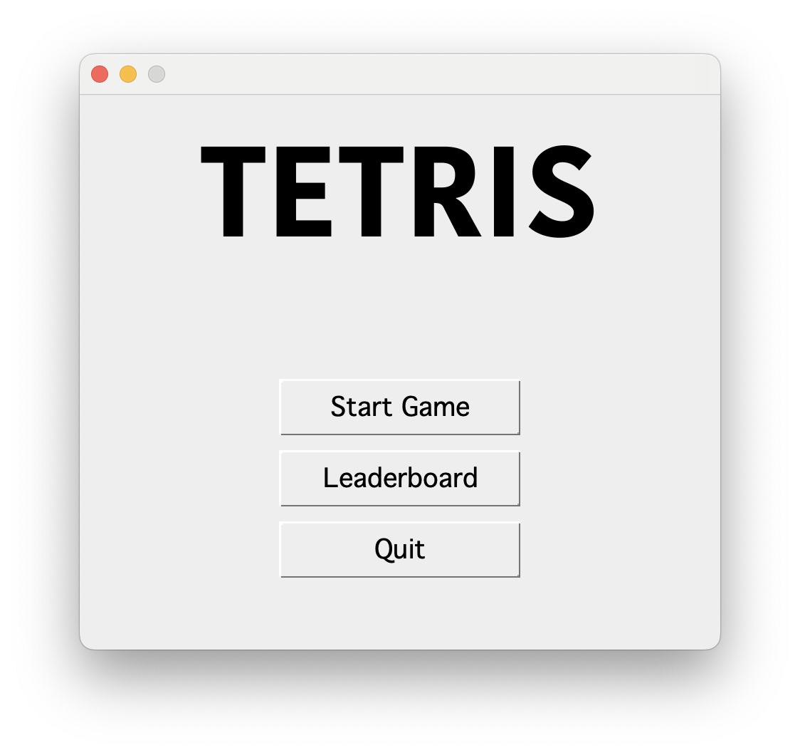
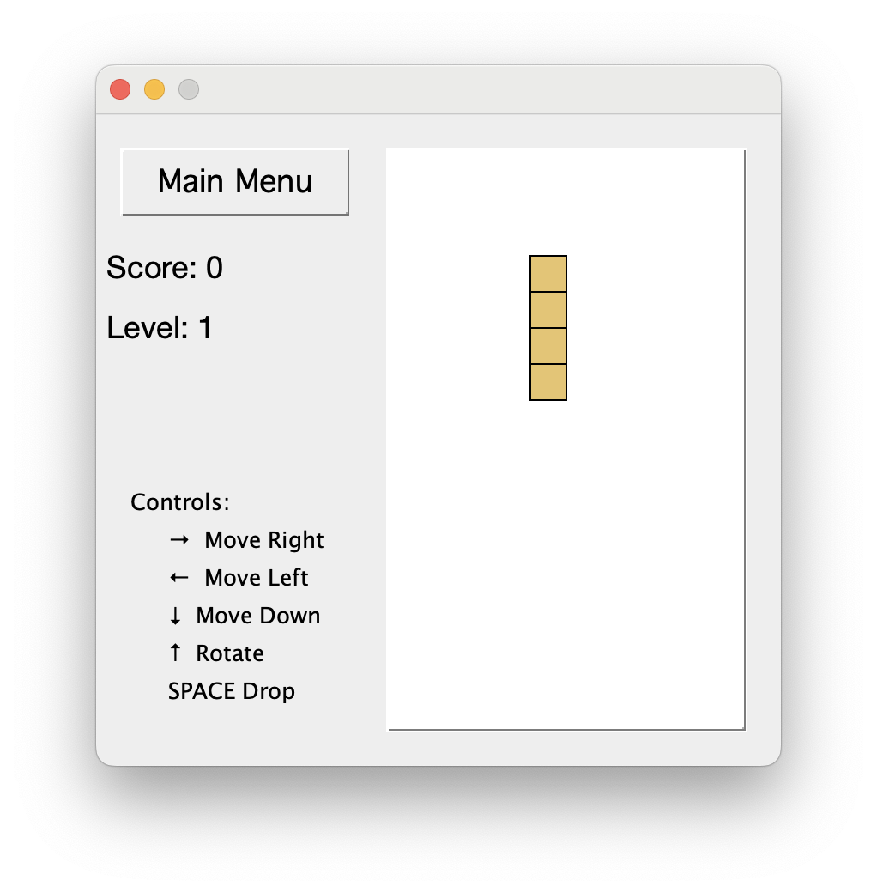
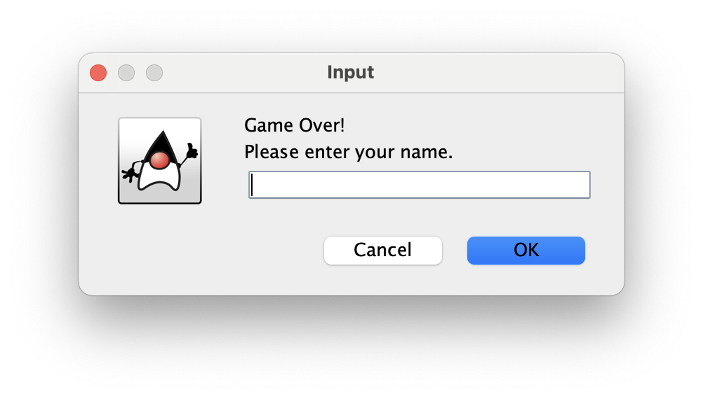
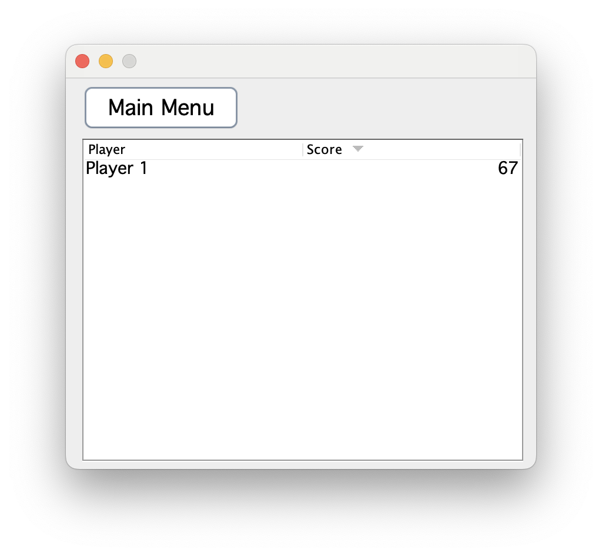

<h1 align="center" id="title">Tetris Game using Java Swing</h1>

<p id="description">This project is a classic implementation of the Tetris game using Java Swing. It offers a graphical user interface (GUI) where players can enjoy the timeless puzzle game.</p>

<h2>Project Screenshots:</h2>

<p align="center" width="100%">
     
     
</p>

<p align="center" width="100%">
     
     
</p>

   
<h2>Features</h2>

Here're some of the project's best features:

*   Classic Tetris gameplay
*   Intuitive controls
*   Graphical interface using Java Swing
*   Score tracking


<h2>Installation Steps:</h2>

### Option 1: Play the Game Using the `.jar` File

<p>1. Clone the git repository</p>

```
git clone https://github.com/JuliaShst/Tetris-Java-Swing.git
```

<p>2. Navigate to the dist directory in the cloned repository<p>
<p>3. Run the .jar file using the following command:<p>

```
java -jar Tetris-Java-Swing.jar
```

### Option 2: Run the Game Through Apache NetBeans

<p>1. Clone the git repository</p>

```
git clone https://github.com/JuliaShst/Tetris-Java-Swing.git
```

<p>2. Open the project in Apache NetBeans:</p>

*   Open Apache NetBeans
*   Click on `File` > `Open Project`
*   Navigate to the cloned repository and select it
  
<p>3. Run the project in Apache NetBeans:</p>

*   Right-click on the project in the Projects window
*   Select `Run`
